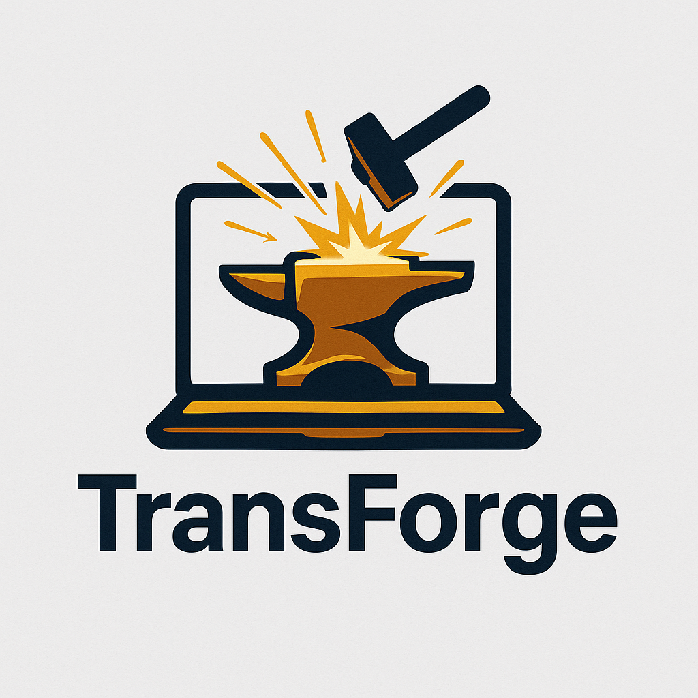

  

## What is this repo for?
Transformer forge based on CS336 Assignments.

It's a repo containing my implementation of tokenizer, transformer model, triton kernel, Reinforcement Learning etc.

And I use this as a repo marking down my development journey and experience too.

